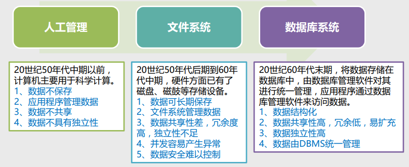
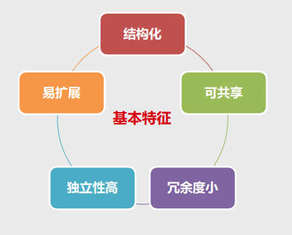
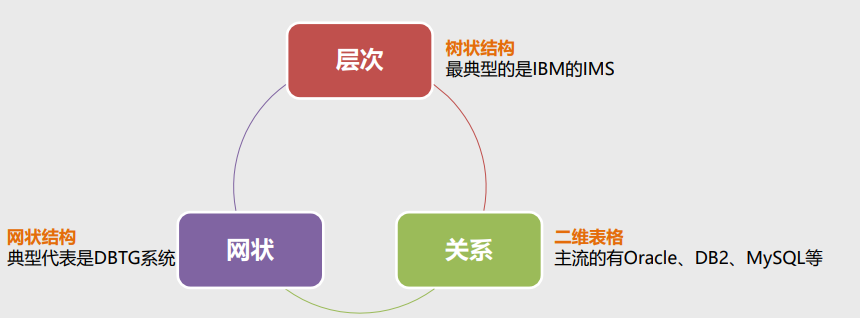
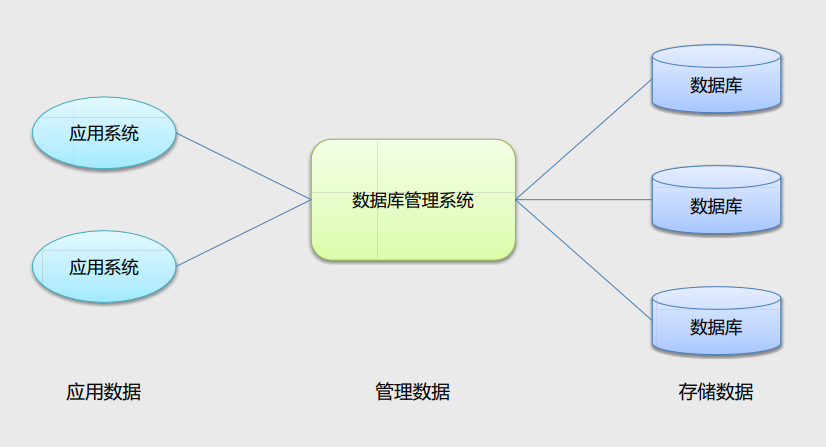

# 01-01 MySQL 介绍

## Target

- 了解数据的概念
- 了解数据库及分类
- 了解主流的关系型数据库

## 数据

> 数据是事实或观察的结果，它是对客观事物的逻辑归纳，是信息的表现形式和载体，可以是符号、 文字、数字、语音、图像、视频等。

数据举例：

​	学生记录（张三，男，1999，贵州，2018，贵州大学）

**数据的本身并没有意义，并不 能完全表达其内容，只有经过 处理解释后才有意义。**

## 数据库管理技术

数据管理是数据处理的中心问题，是数据库的核心任务，主要包括对数据进行分类、组织、编码、 存储、检索和维护。

**数据管理技术发展的三个阶段：**

## 数据库

数据库是按照数据结构来组织、存储和管理数据的仓库。 

数据库是长期储存在计算机内的、有组织的、可共享的、统一管理的大量数据的集合。数据库中的 数据按一定的数据模型组织、描述和储存，具有较小的冗余度、较高的数据独立性和易扩展性，并 可为各种用户共享。

## 数据库的分类

根据数据模型的不同，数据库通常被分为层次数据库、网状数据库和关系数据库。

**说明：对数据库的划分常见的还有另外一种，即关系型数据库和非关系型数据库。像我们经常听说的Redis、 MongoDB就属于非关系型数据库。可以在此了解非关系型数据库 http://nosql-database.org/**

## 数据库管理系统

**数据库管理系统（Database Management System，简称DBMS）是专门用于管理数据库的计算 机软件。**

数据库管理系统能够为数据库提供数据的定义、建立、维护、查询和统计等操作功能，并完成对数 据完整性、安全性进行控制的功能，它位于用户和操作系统之间，是一层数据管理软件。

**说明：我们通常所说的数据库，其实是指数据库管理系统.**

## 数据库管理系统与数据库的关系

## RDBMS介绍

RDBMS是Relational Database Management System的简称，即关系型数据库管理系统，它是 指采用了关系模型来组织数据的数据库，其以行和列的形式存储数据，以便于用户理解，关系型数 据库这一系列的行和列被称为表，一组表组成了数据库，用户通过查询来检索数据库中的数据。

- ** RDBMS的特点 **：
  1. 数据以表格的形式出现 
  2. 每行为一条记录
  3.  每列为记录名称所对应的数据 **域（Field）** 
  4. 许多的行和列组成一张单 ** 表（Table）** 
  5. 若干单表组成 ** 数据库（Database）** 
  6. 查询方式：关系型数据库采用结构化查询语言（即 ** SQL **）来对数据库进行查询 
  7. 事务性：关系型数据库强调** ACID **规则，即**原子性（Atomicity）、一致性（Consistency）、隔离性（ Isolation）、持久性（Durability）**
  8. 读写性能：关系型数据库十分强调数据的一致性，并为此降低读写性能付出了巨大的代价，在面对海量数 量处理、高并发数据读写等场景时性能下降的非常厉害 

## 主流的RDBMS

市面上能够接触到的关系型数据库有很多，主流的有以下几种。

- SQL Server
  - 微软推出的DBMS（最初由Microsoft、Sybase和Ashton-Tate共同研发）
  - 运行于Windows NT平台
- Sybase
  - Sybase公司 
  - 可以运行于Windows NT、Unix/Linux平台
- DB2
  - IBM公司 
  - 主要运行于Unix（包括IBM的AIX）、Linux和Windows
- Oracle
  - Oracle公司 
  - 世界第一个支持SQL语言的商业数据库，应用广泛，功能强大
- **MySQL**
  - **瑞典MySQL AB公司开发，08年被SUN收购，09年SUN被Oracle收购** 
  - **体积小，速度快，开源免费；最流行的关系型数据库管理系统**

@ 	笔记记录于 2020-8-21 22:50:38	FROM	CSDN 《MySQL数据库入门实战课 ---  柳峰》