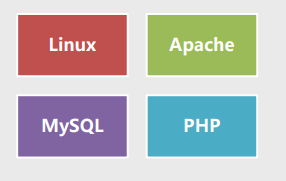
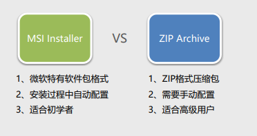
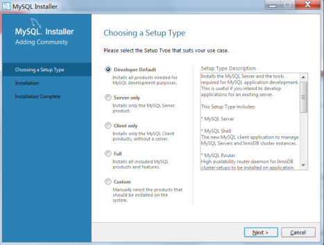
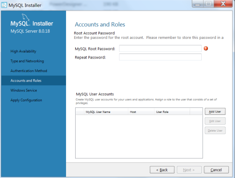
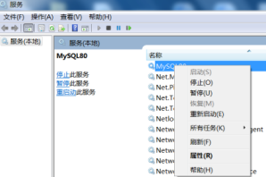
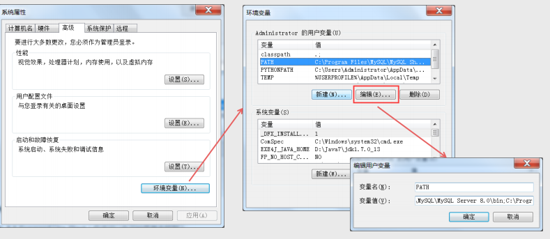
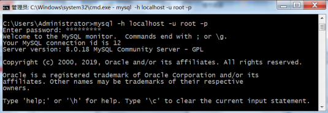
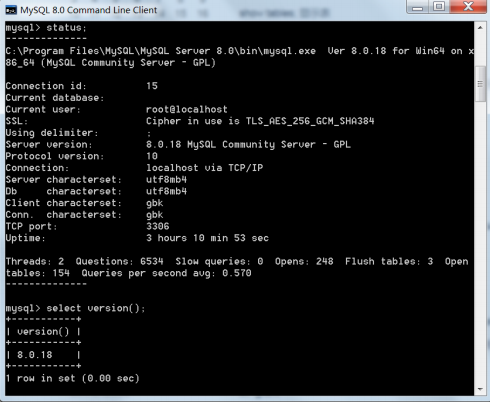

# 01-02 MySQL 安装配置

## Target

- 了解MySQL及各版本差别 
-  掌握下载、安装MySQL 
-  掌握如何连接MySQL

## MySQL简介

MySQL是一个小型关系型数据库管理系统（RDBMS），开发者为瑞典MySQL AB公司。在2008年 1月16号被Sun公司收购，而2009年，SUN又被Oracle收购。 

目前MySQL被广泛地应用在Internet上的中小型网站中，由于其体积小、速度快、总体拥有成本低， 尤其是开放源码这一特点，许多中小型网站为了降低成本而选择MySQL数据库。

目前，互联网上非常流行的网站构架组合是LAMP。

## 社区版与企业版

MySQL的官网是 www.mysql.com，在下载界面可以看到两种版本选择： Community和 Enterprise，即社区版和企业版。

### 社区版

1. 遵循GPL协议，开源，免费 
2. 未经严格测试，存在技术风险 
3. 无实时图形监控，无技术支撑

### 企业版

1. 收费，http://www.mysql.com/products/ 
2. 严格测试，安全、稳定、可靠 
3. 实时图形监控，专业技术支持

## MySQL社区版下载

MySQL社区版的下载地址： http://dev.mysql.com/downloads/mysql/ 

如果是Windows平台，有两种安装包可供选择：MSI Installer和 ZIP Archive。

## 安装MySQL（1）

MySQL的安装类型有Developer、Server only、Client only、Full和Custom五种。

## 安装MySQL（2）

设置MySQL数据库超级管理员root的密码。

## 启停MySQL服务

### 图形界面

- 启动windows的【服务】

  a）dos窗口执行：** services.msc ** 

  b）依次点击控制面板-管理工具-服务

- 右键启停mysql服务

  

### 命令行

-  启动mysql服务 

  ** net start mysql80 ** 

- 停止mysql服务 

  ** net stop mysql80 **

## 配置环境变量（非必须）

将MySQL安装路径下的 MySQL Server 8.0\bin 添加到环境变量path中。

如果采用默认安装，添加 到环境变量path中的完整路径 

C:\Program Files\MySQL\MySQL Server 8.0\bin

## 连接到MySQL

在Windows dos或Linux shell中，使用mysql命令可以连接到MySQL服务器，执行各种数据库管 理操作。

- 连接到本机上的MySQL服务器 

  **mysql –h localhost –u root -p**

## 查看MySQL版本

连接到MySQL数据库之后，可以使用status命令或version()函数查看MySQL版本信息。

