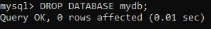

# DDL 之数据库

## Target

1. 了解结构化查询语言SQL
2. **<font color="red">掌握数据库相关的操作（Important！！）</font>**


## SQL 简介

SQL是**Structured Query Language**的缩写，即**结构化查询语言**。

SQL是一门标准的计算机语言， 用于访问和操作数据库，其主能包括数据定义、数据操纵、数据查询和数据控制。 SQL已成为RDBMS的标准语言，但不同的RDBMS使用的SQL版本有一些差异，它们都有一些私有 扩展。

### **<font color="red">SQL 能做什么？</font>**

1. SQL可以创建和管理数据库、数据表、存储过程、视图等 
2. SQL可以向数据库中插入新的记录，并可进行修改、删除 
3. SQL可以查询数据库中的记录 
4. SQL可以对数据库进行事务控制和权限管理

## SQL语言的分类

按照功能用途，可以将SQL语言分为4类：DDL、DML、DQL和DCL。


- <font color="orange">数据定义语言 DDL(Data Definition Language) ：用于数据库、表、视图等的建立、删除</font>
- DDL 包括：

```mysql
	CREATE - 创建			ALTER - 更新			DROP - 删除
```


- <font color="orange">数据操纵语言 DML(Data Manipulation Language) ：用于 添加、删除和修改数据表中的记录。</font>
- DML包括：

```mysql
	INSERT - 插入			DELETE - 删除			UPDATE - 更新
```


- <font color="orange"> 数据控制语言 DCL ( Data Control Languag) : 包括数据库对象的权限管理和事务管理.</font>
- DCL 包括：

```mysql
	COMMIT - 提交			ROLLBACK - 回滚		GRANT - 授予
```


- <font color="orange"> 数据查询语言 DQL（Data Query Language) :查询是数据库的基本功能.</font>

- DQL ：

```mysql
	SELECT - 查询数据表
```


## DDL之数据库

- 在 DDL 中，对数据库的操作主要有两种：**<font color="orange"> 创建</font>** 和 **<font color="orange"> 删除</font>**


```mysql
# 创建数据库
CREATE DATABASE database_name；

# 删除数据库
DROP DATABASE database_name；

# 显示所有存在的数据库
SHOW DATABASES；

# 显示所在数据库下的所有存在的表
SHOW TABLES;

# 显示当前在哪个 数据库下 工作
SELECT DATABASE();

	- NULL ： 表示没有
	
# 进入要进行工作的数据库
USE database_name;
```

### 例子：


- **创建 mydb 之前 show databases :** 


- **创建 mydb **：

   

- **创建 mydb 之后 show databases :**

  

- **删除 mydb** :

  

- **删除 mydb 之后 show databases :**

  

- **显示当前在哪个数据库工作：**


- **创建 mydb 数据库，并进入：**


- **显示 mydb 数据库下所有存在的表格：**

  