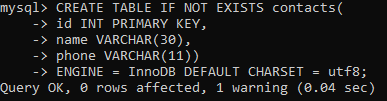
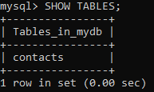

# DDL之数据表

## Target

1. 了解存储引擎engine 
2. 熟悉MySQL的数据类型 
3. 熟悉MySQL的建表语法 
4.  **<font color="orange"> 掌握数据表的相关操作 (Important!)</font>**

## MySQL 存储引擎

存储引擎，就是如何存储数据、如何更新数据、如何查询数据、如何为存储的数据建立索引等一系 列技术的实现方法。

```mysql
# 查看 MySQL 支持的存储引擎

show engines;
```

| 存储引擎       | 描述                                                         |
| -------------- | ------------------------------------------------------------ |
| **MyISAM**     | 拥有较快的插入、查询速度，但 **<font color="red"> 不支持事务</font>** |
| **InnoDB**     | **<font color="red">支持ACID事务</font>**，支持行级锁，支持外键；MySQL 5.5 版本后的默认存储引擎 |
| **MRG_MYISAM** | 将一组结构相同的 MyISAM 表聚合成一个整体，再进行增删改查操作 |
| **Memory**     | 所有数据存储在内存中，响应快；MySQL 重启时，数据会全部丢失   |
| **Archive**    | 归档，且有压缩机制，适用于历史数据归档                       |
| **CSV**        | 逻辑上由逗号分隔数据，会为每张表创建一个 **.csv文件**        |


## MySQL数据类型

在创建数据表时，准确的定义字段的数据类型是非常重要的。

MySQL 支持多种数据类型，但大致可以分为3类：**数值、日期/时间 **和 **字符串（字符）类型**。


​																		`数值类型`


|                 类型                 |                 所占字节数                 | 说明                                            |
| :----------------------------------: | :----------------------------------------: | ----------------------------------------------- |
|             **tinyint**              |                     1                      | 小整数值，如状态                                |
|             **smallint**             |                     2                      | 大整数值                                        |
|            **mediumint**             |                     3                      | 大整数值                                        |
| **<font color = "red"> int</font>**  |       **<font color="red">4</font>**       | **<font color="red">大整数值</font>**           |
|              **bigint**              |                     8                      | 极大整数值                                      |
|              **float**               |                     4                      | 单精度浮点数值                                  |
|              **double**              |                     8                      | 双精度浮点数值                                  |
| **<font color="red">decimal</font>** | **<font color="red"> Max(D+, M+) </font>** | **<font color="red">含小数值，例如金额</font>** |


​																		`日期和时间类型`


|                 类型                  |           所占字节数           | 说明                                                         |
| :-----------------------------------: | :----------------------------: | ------------------------------------------------------------ |
|   **<font color="red">data</font>**   | **<font color="red">3</font>** | **<font color="red">YYYY-MM-DD</font>**                      |
|               **time**                |               3                | HH : MM : SS                                                 |
|                 year                  |               1                | YYYY                                                         |
| **<font color="red">datetime</font>** | **<font color="red">8</font>** | **<font color="red">YYYY-MM-DD</font>** <br/> **<font color="red">HH : MM : SS</font>** |
|               timestamp               |             **8**              | YYYYMMDDHHMMSS                                               |

​																							

​																						`字符串类型`


|                  类型                  |                所占字节数                | 说明                                      |
| :------------------------------------: | :--------------------------------------: | ----------------------------------------- |
|                  char                  |                 0 ~ 255                  | 定长字段串                                |
| **<font color="red"> varchar </font>** | **<font color="red"> 0 ~ 65535 </font>** | **<font color="red"> 变长字符串 </font>** |
|  **<font color="red"> text </font>**   |  **<font color="red">0 ~ 65535</font>**  | **<font color="red">长文本数据</font>**   |
|                  blob                  |                                          | 二进制形式的文本数据                      |


## DDL之数据表（1）

在DDL中，对数据表的操作主要有3种：**<font color="orange"> 创建 </font>**、**<font color="orange">修改</font> **和 **<font color="orange">删除</font>**。 

创建数据表，需要定义的信息主要包括：**<font color="orange">表名</font>**、**<font color="orange">字段名</font>**、**<font color="orange">字段类型</font>**。

- **注意：数据表要在一个数据库下面创建才有效**.

```mysql
# MySQL的建表语法

CREATE [TEMPORARY] TABLE [IF NOT EXISTS] table_name [(create_definition, ...)] [table_options] [select_statement]

# 查看表的详细内容
DESC table_name;
```

- 说明：
  - **TEMPORARY ：表示创建临时表，在当前回话结束后将自动消失**
  - **IF NOT EXISTS : 在建表之前，先判断表是否存在，只有该表不存在时才创建**
  - **<font color="red"> create_definition </font> : 建表语句的关键部分，用于定义表中各列的属性**
  - **table_options : 表的配置选项，例如：表的默认存储引擎、字符集**
  - **select_statement : 通过 select 语句建表**

### 例子：

- 创建并进入 mydb 数据库下：

  

- 在 mydb 数据库下 创建 contacts 表：



- 显示 mydb 数据库下的所有存在的：

  

- 查看 表 contacts 的详细内容：

  

## DDL之数据表（2）

对于已经存在的表，可以使用 **<font color="orange"> alter 命令添加、修改、删除字段，也可以对表进行删除操作</font>**。

```mysql
# 添加字段 sex, 类型为 VARCHAR（1）
ALTER TABLE contacts ADD sex VARCHAR(1);

# 修改字段 sex 的类型为 tinyint
ALTER TABLE contacts MODIFY set tinyint;

# 删除字段 sex
ALTER TABLE contacts DROP COLUMN sex;

# 删除 contacts 表
DROP TABLE contacts;
```

- 添加字段 sex, 类型为 VARCHAR（1）

  

- 修改字段 sex 的类型为 tinyint


- 删除字段 sex

  

- 删除 contacts 表

