# DML 插入、修改、删除数据

## Target

1. 掌握如何向表中`插入`数据 

2. 掌握如何`修改`表中的数据 

3. 掌握如何`删除`表中的数据

   

## 插入数据 <font color="red"> INSERT INTO </font>

在MySQL中，使用insert into语句向数据表中插入数据。

###  INSERT 插入单条数据

```mysql
INSERT INTO table_name (field1, field2, ..., fieldN) VALUES (value1, value2, ..., valueN);
```

### INSERT 插入多条数据

```mysql
INSERT INTO table_name (field1, field2, ..., fieldN) VALUES (valueA1, valueA2, ..., valueAN), (valueB1,
valueB2, ..., valueBN), …, (valueN1, valueN2, ..., valueNN);

```

- 注意事项：
  1. `如果字段是字符型，值必须使用单引号或者双引号，如”value”;`
  2. `如果值本身带单引号或双引号，需要转义 ;`
  3. `如果所有列都要添加数据，insert into语句可以不指定列，即`

```mysql
 INSERT INTO table_name VALUES (value1, value2, ..., valueN);
```


- 例子：

```mysql
INSERT INTO contacts(id,name,phone) VALUES (001,'Benjamin','123456789');
```

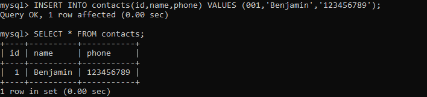

## 修改数据 <font color="red">UPDATE ...SET...</font>

在MySQL中，使用update语句来修改数据表中的数据

### UPDATE ...SET... 语法

```mysql
UPDATE table_name SET field1=newValue1, field2=newValue2 [WHERE Clause]
```

- 注意事项： 
  1. `可以同时更新一个或多个字段` 
  2. `可以通过where子句来指定更新的范围，如果不带where，则更新数据表中的所有记录`

- 例子：

```mysql
 UPDATE contacts SET phone='000000000' where name = 'Benjamin';
```

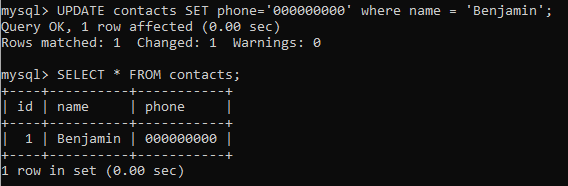

## 修改数据 <font color="red">DELETE </font>

在MySQL中，使用delete语句来删除数据表中的数据

### DELET 语法

```mysql
DELETE FROM table_name [WHERE Clause]
```

- 注意事项： 

  ​	`可以通过where子句来指定删除的范围，如果不带where，则删除数据表中的所有记录`

- 例子：

  - 向表中插入数据：

  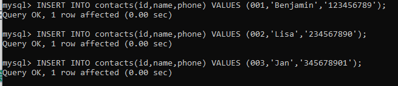

  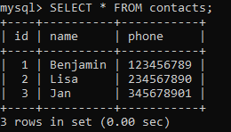

  - 删除 id = 1 的数据：

    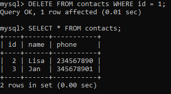

  - 删除全表数据：

    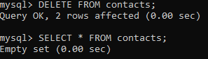


## 例子

- 创建 contacts 表，并单行插入 3 行数据

  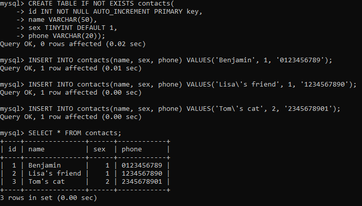

- 多行插入 2 行数据：

  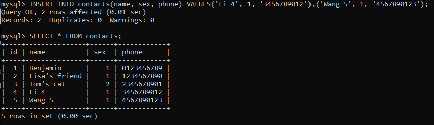

- 更新表中 sex 值都为 2（不带限定）：

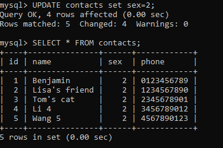

- 更新 id = 3 的 sex 值 为 2：

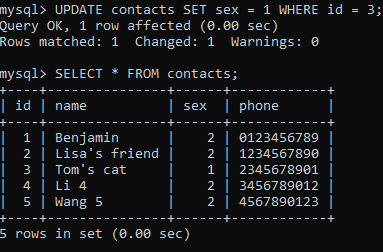

- 更新 id = 2 的 sex = 1, phone = '000000000':

  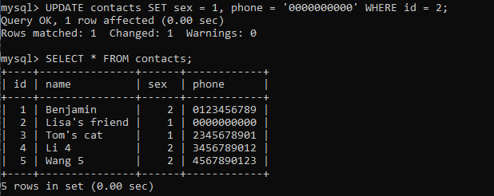

- 删除 id = 4 的数据:

  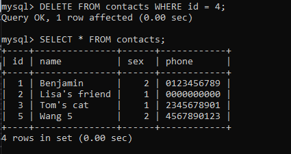

- 删除所有数据（不带 WHERE 限定）：

  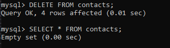