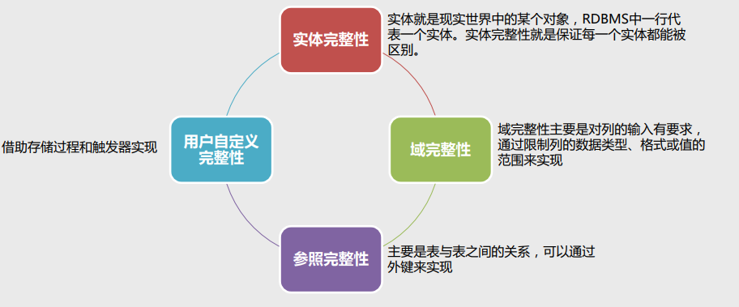
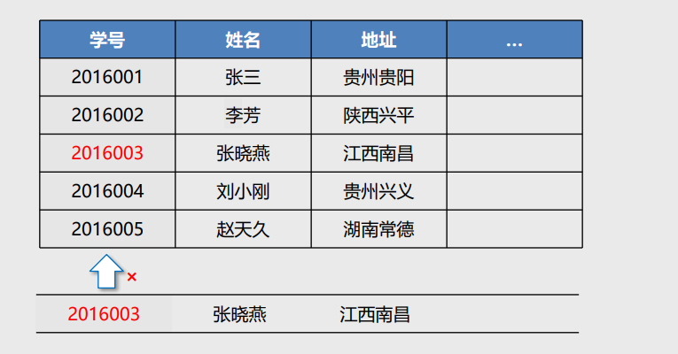
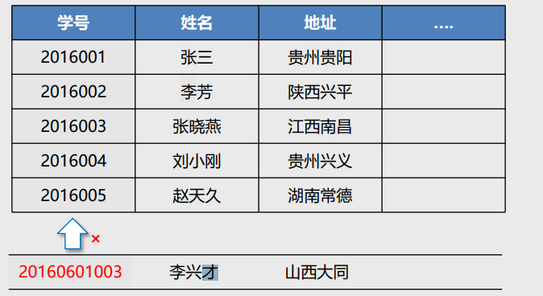
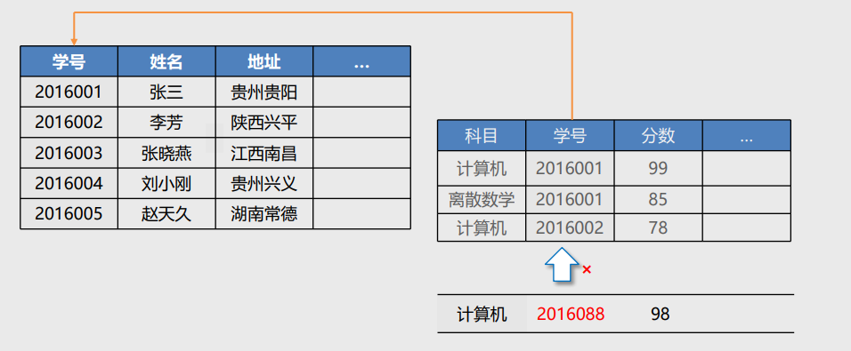
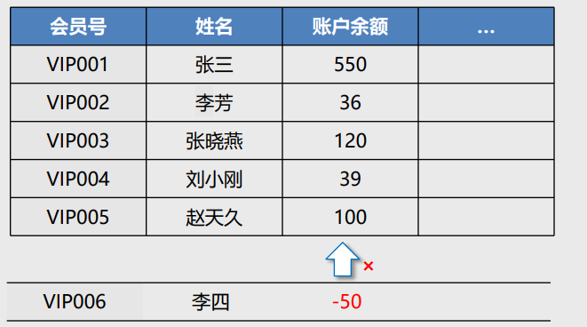

# 数据完整性

## Target

1. 了解什么是数据完整性 
2. `掌握如何保证数据完整性（Important）`

## 数据完整性的定义

数据完整性是指存储在数据库中的数据，应该保持一致性和可靠性。 

关系模型允许定义三类数据约束，它们是实体完整性、参照完整性以及用户定义的完整性约束，其 中前两种完整性约束由关系数据库系统自动支持。



## 实体完整性

实体完整性要求每张表都有唯一标识符，每张表中的主键字段不能为空且不能重复。

`约束方法：唯一性约束、主键约束、标识列`



## 域完整性

域完整性是针对某一具体关系数据库的约束条件，它保证表中某些列不能输入无效的值。 

域完整性指列的值域的完整性，如数据类型、格式、值域范围、是否允许空值等。

`约束方法：限制数据类型、检查约束、默认值、非空约束`



## 参照完整性

参照完整性要求关系中不允许引用不存在的实体。

`约束方法：外键约束`



## 用户自定义完整性

用户自定义完整性是针对某一具体关系数据库的约束条件，它反映某一具体应用所涉及的数据必须 满足的语义要求。

`约束方法：规则、存储过程、触发器`



## 唯一性约束 **<font color="red">UNIQUE</font>**

在MySQL中，可以使用关键字 UNIQUE 实现字段的唯一性约束，从而保证实体的完整性。 

- `UNIQUE 意味着任何两条数据的同一个字段不能有相同值。` 
- `一个表中可以有多个 UNIQUE 约束。`

```mysql
# 在创建表时，添加唯一性约束

create table person(
	id int not null auto_increment primary key comment '主键id',
	name varchar(30) comment '姓名',
	id_number varchar(18) unique comment '身份证号'
);
```

## 外键约束**<font color="red">FOREIGN KEY</font>**

外键（FOREIGN KEY）约束定义了表之间的一致性关系，用于强制参照完整性。

 外键约束定义了对同一个表或其他表的列的引用，这些列具有PRIMARY KEY或UNIQUE约束。

`在插入数据时，必 须先向主表插入， 再向从表插入。删 除数据时正好相反。`

- 主表：学生表

```mysql
create table stu(
 	stu_no int not null primary key comment '学号',
 	stu_name varchar(30) comment '姓名'
);
```

- 从表：成绩表

```mysql
create table sc(
     id int not null auto_increment primary key comment '主键id',
     stu_no int not null comment '学号',
     course varchar(30) comment '课程',
     grade int comment '成绩',
     foreign key(stu_no) references stu(stu_no)
);
```

