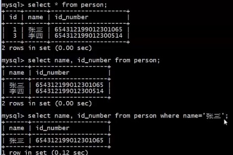

# 简单查询

## Target

1. 了解select的完整语法
2.  **掌握使用select进行简单查询**

## 使用 select 查询数据

在SQL中，使用select语句来查询数据。

不同的关系数据库，select语法会有细微差别，

在MySQL 官网 https://dev.mysql.com/doc/refman/8.0/en/select.html 可以查到支持的select语法。

```mysql
SELECT column_name1, column_name2
FROM table_name
[WHERE where_condition]
[GROUP BY {col_name | expr | position}, ... [WITH ROLLUP]]
[HAVING where_condition]
[ORDER BY {col_name | expr | position} [ASC | DESC], ... [WITH ROLLUP]]
[LIMIT {[offset,] row_count | row_count OFFSET offset}]
```

