# where 子句 

## Target

1. 熟练掌握where子句各类运算符的使用 
2. 熟练掌握多条件查询and、or的使用

## where 子句 （单条件查询）

`在SQL中，insert、update、delete和select后面都能带where子句，用于插入、修改、删除或查 询指定条件的记录。`


```mysql
# SQL 语句中使用 where 子句语法
SELECT column_name FROM table_name WHERE column_name 运算符 value
```

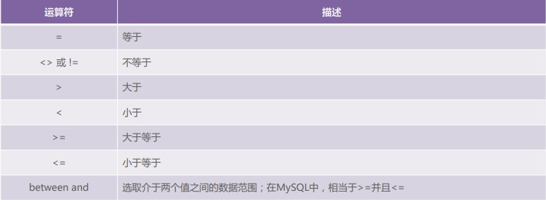

## where子句（多条件查询）

`在where子句中，使用and、or可以把两个或多个过滤条件结合起来。`

```mysql
# and、or 运算符语法
SELECT column_name FROM table_name WHERE condition1 AND condition2 OR condition3
```

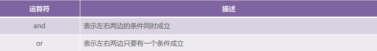

## 例子

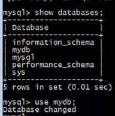


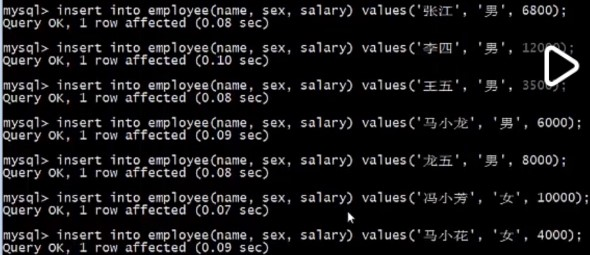

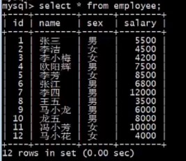

- 筛选所有男性员工：

  ```mysql
  SELECT * FROM employee WHERE sex = '男'；
  
  # or
  
  SELECT * FROM employee WHERE sex != '女'；# 不建议这样子写，不直观
  ```

  


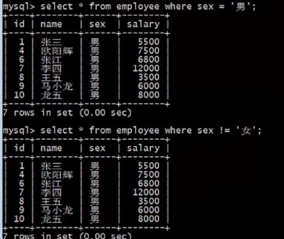

- 筛选薪资大于 1w的员工

```mysql
SELECT * FROM employee WHERE salary > 10000;
```

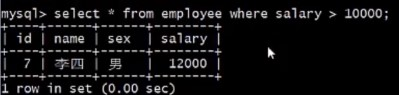

- 筛选薪资大于等于 1w的员工

```mysql
SELECT * FROM employee WHERE salary >= 10000;
```


- 筛选薪资在 1w 和 1.2 的员工

```mysql
SELECT * FROM employee WHERE salary between 10000 and 12000;
```

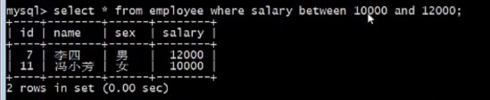

- 筛选薪资大于等于 1w的男性员工

  ```mysql
  SELECT * FROM employee WHERE sex = '男' and salary > 10000;
  ```

  

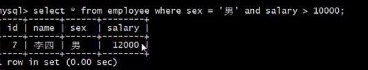

- 筛选薪资大于等于 1w 或者 性别是 男的员工

```mysql
SELECT * FROM employee WHERE sex = '男' or salary >= 10000;
```

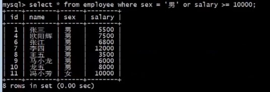

- 筛选薪资小于等于 4000 或者 大于等于 1w 的 男的员工

```mysql
SELECT * FROM employee WHERE sex = '男' and （salary <= 4000 or salary >= 10000）;
```


- 注意：要用（）限制作用范围

```mysql
# 没有 用 () 限制 or 的作用范围时
SELECT * FROM employee WHERE sex = '男' and salary <= 4000 or salary >= 10000;

==>

SELECT * FROM employee WHERE (sex = '男' and salary <= 4000) or salary >= 10000;
```

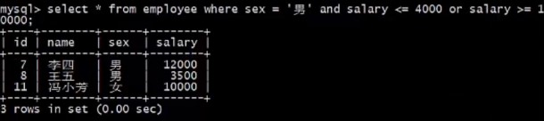