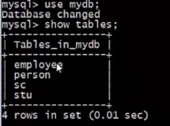
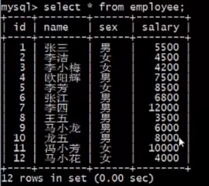
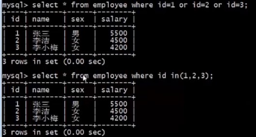
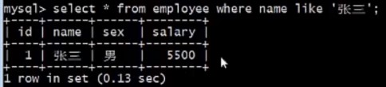
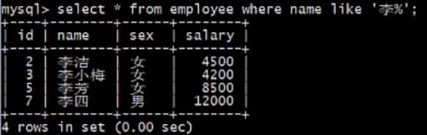
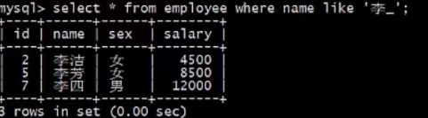
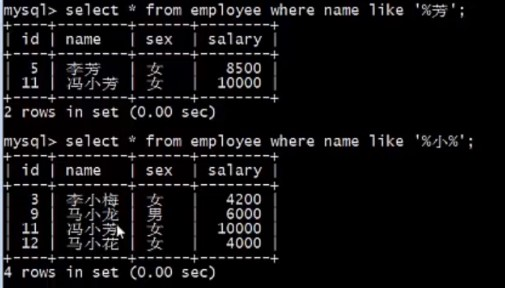

# IN 和 LIKE 的使用

[toc]

## Target

1. 掌握运算符in的使用 
2. 掌握运算符like的使用

## 运算符 `in` 

`运算符 IN 允许我们在 WHERE 子句中过滤某个字段的多个值。`

```mysql
# where子句使用in语法
SELECT column_name FROM table_name WHERE column_name IN(value1, value2, …)
```

## 运算符`like`

`在where子句中，有时候需要查询包含xxx 字符串的所有记录，这时就需要用到运算符like。`

```mysql
#where子句使用like语法
SELECT column_name FROM table_name WHERE column_name LIKE ‘%value_’
```

>
>
>**说明：** 
>
>**1、LIKE子句中的`%`类似于正则表达式中的`*`，匹配`任意0个或多个字符`**
>
>**2、LIKE子句中的`_`匹配`任意单个字符`** 
>
>**3、LIKE子句中如果没有%和_，就相当于运算符`=`的效果**

## 例子





- 查询 id = 1 or id = 2 or id = 3 的数据

```mysql
# or 写法
SELECT * FROM employee WHERE id = 1 or id = 2 or id 3;

# in 写法
SELECT * FROM employee WHERE id in(1,2,3);
```



- 查询名字为张三的数据

```mysql
# LIK 不带 % 和 _
SELECT * FROM employee WHERE name LIKE '张三'；
```



- 查询姓李多字数据

```mysql
SELECT * FROM employee WHERE name LIKE '李%'；
```



- 查询姓李单字数据

```mysql
SELECT * FROM employee WHERE name LIKE '李_';
```



- 查询姓名以芳结尾的数据



- 查询姓名带小字的数据