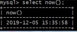
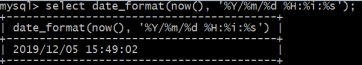
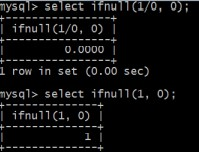
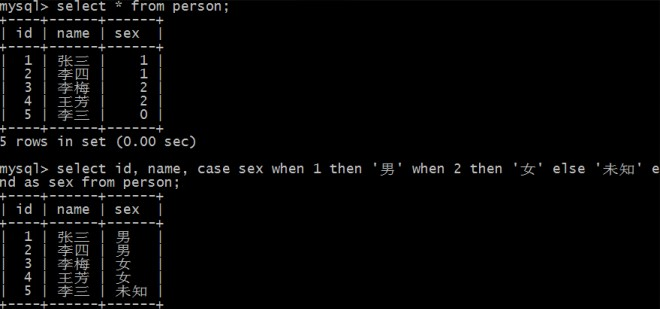

# MySQL 常用函数


## MySQL 内置函数介绍


MySQL 内置函数是指 MySQL 数据库提供的内置函数，包括数学函数、字符串函数、日期和时间函数、聚合函数、条件判断函数等，这些内置函

|       函数       |                             描述                             |
| :--------------: | :----------------------------------------------------------: |
|     数学函数     |            ABS、SQRT、MOD、SIN、COS、TAN、COT...             |
|    字符串函数    |           LENGTH、LOWER、UPPER、TRIM、SUBSTRING...           |
| 日期和时间函函数 | **NOW**、CURDATE、CURTIME、SYSDATE、**DATE_FORMAT**、YEAR、MONTH、WEEK... |
|     聚合函数     |      **COUNT** 、**SUM**、**AVG**、**MIN**、**MAX**...       |
|   条件判断函数   |               IF、**IFNULL**、**CASE WHEN**...               |
|   系统信息函数   |                  VERSION、DATABASE、USER...                  |
|     加密函数     |                      MD5、SHA1、SHA2...                      |


## 常用函数解析

###  now() 函数

- `用于返回当前的日期和时间.`

  

- 应用场景：

  > 在实际应用中，大多数业务表都会带一个创建时间 create_time 字段，用于记录每一条数据的产生时间.
  >
  > 在向表中插入数据时，就可以在 insert 语句中使用 now() 函数.

  

- 示例如下：

  ```mysql
  insert into user(id,name,create_time) values(1,'zhangsan',now());
  ```

  

###  date_format() 函数

- `用于以指定的格式显示日期/时间.`

  

- 应用场景：

  >在实际应用中，一般会按照标准格式存储日期/时间，如 2019-12-13 14:15:16.
  >
  >在查询使用数据时，往往又会有不同的格式要求，这时就需要使用 data_format() 函数进行格式转换.

- 示例如下：

  ```mysql
  select name, date_format(birthday, '%Y/%m/%d') from user;
  ```

### 聚合函数

- `聚合函数是对一组值进行计算，并返回单个值.`

  MySQL 常用的聚合函数有 如下 5 个

| 函数  | 描述                           |
| :---: | :----------------------------- |
| count | 返回符合条件的记录总数         |
|  sum  | 返回指定列的总和，忽略空值     |
|  avg  | 返回指定列的平均值，忽略空值   |
|  min  | 返回指定列的最小值，忽略空值   |
|  max  | 返回指定列的最大盒子，忽略空值 |

说明： 忽略空值得意思是，自动忽略 值 为 null 空的 数据，不把它当做一条数据进行计算。

- 举例说明：


```mysql
> select count(*) from employee;		# 返回 员工 总数

> select count(*) from employee where sex = '男'； # 返回 男员工 总数

> select count(*) from employee where sex = '女'； # 返回 女员工 总数

> select sum(salary) from employee;	# 计算 工资 总和 80500

> select avg(salary) from employee;	# 计算平均工资 6708.3333

> select max(salary) from employee; # 返回最大工资 12000

> select min(salary) from employee; # 返回最小工资 3500

```


- 例子 ：

  忽略空值 - 插入一个空值，并进行与上个例子相同的操作；结果相同，可以发现空值自动被忽略。

  ```mysql
  > insert into employee(name, sex, salary) values('柳峰'，'男'，null); # 插入 一个 salary 为 null 空的 值
  
  > select sum(salary) from employee; # 计算员工总工资 80500
  
  > select avg(salary) from employee;	# 计算员工平均工资 6708.3333
  
  > select max(salary) from employee; # 返回员工最大工资 12000
  
  > select min(salary) from employee;	# 返回员工最小工资 3500
  ```

  

  

  

### ifnull() 函数

- `函数 ifnull()用于处理 NULL 值 : ifnull(v1,v2), 如果 v1 的值不为 NULL, 则返回 v1, 否则返回 v2.`

  

###  case when 条件判断函数

- `case when 是流程控制语句，可以在 SQL语句中使用 case when 来获取更加准确和直接的结果.`

  `SQL 中的 case when 类似于编程语言中的 if else 或者 switch.`

- 语法格式

  ```mysql
  # case when 的语法有两种
  CASE [col_name] WHEN [value1] THEN [result1] ... ELSE [default] END
  CASE WHEN [expr] THEN [result1] ... ELSE [default] END
  ```

- 例子1：

  

- 例子2：从 employee 表中，打印 id,name,sex,salary，并且，sex 是 男，打印 F, sex 是 女 打印 M

  ```mysql
  select 
  	id,
  	name,
  	case sex
      	when '男' then 'F'
      	when '女' then 'M'
      	else ''
      end as sex,
      salary
  from employee;
  ```

  


### user() 函数

- `获取系统信息`


### md5() 函数

- `加密函数，将输入的字符串以加密的形式返回.`

