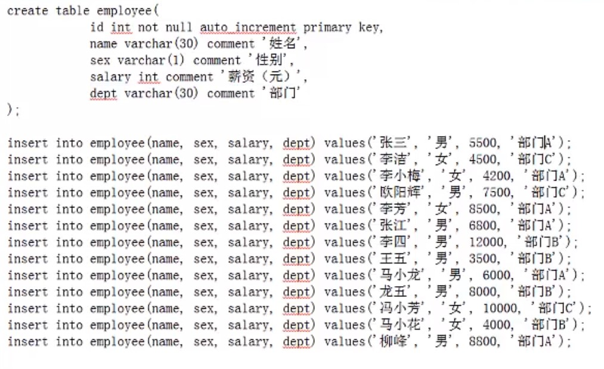
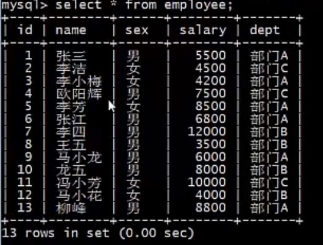
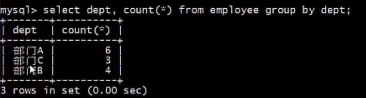
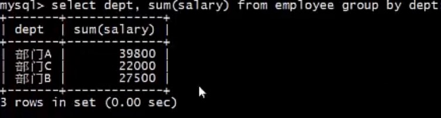
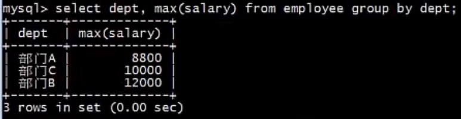
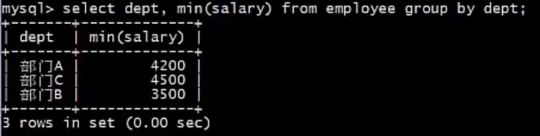
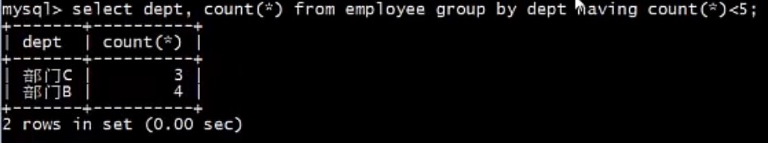
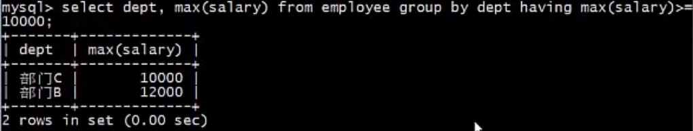

# GROUP BY 和 HAVIN 子句

## 应用场景

使用 select 语句 结合 where 查询条件获取需要的数据后，需要对这些数据分类选取，如下需求：

- 公司想知道每个部门有多少名员工；
- 班主任想统计各科第一名的成绩；
- 某门店想掌握男、女性会员的人数及平均年龄.

## GROUP BY

### 说明

>**从字面上理解， group byu 表示根据某种规则对数据进行分组，它必须配合聚合函数进行使用，对数据进行分组后可以进行 cout、sum、avg、max 和 min 等运算.**


###  语法:

```mysql
SELECT column_name, aggregate_function1(column_name1)，aggregate(column_name2)
FROM table_name
GROUP BY column_name
```

说明：

- aggregate_function : 表示聚合函数；
- group by 可以对一列或多列进行分组

注意：

- `除了按字段分组的字段，其他字段都必须是聚合函数`.

  即，除了第一个字段 column_name 和 按字段分组的字段 GROUP BY column_name 中的 column_name 相同外，其他其他字段，即 column_name 后面的字段 都必须是聚合函数.

## HAVING

### 说明

在 SQL 中增加 HAVING 子句的原因是：

>**WHERE 关键字无法与聚合函数一起使用。**
>
>**HAVING 子句可以对分组后的各组数据进行筛选。**
>
>**常与 GROUP BY 子句，作为筛选条件一起使用。**

### 语法

```mysql
SELECT column_name, aggregate_function(column_name)
FROM table_name
WHERE column_name operator value
GROUP BY column_name
HAVING aggregate_function(column_name) operator value
```


## 例子

### 建表

- 创建新的 employee 表



- 打印创建的新 employee 表

  

### GROUP BY 子句

- 分别计算各性别员工个数

  ```mysql
  select sex, count(*) from employee group by sex;
  ```

  

- 分别计算各部门的员工个数

  ```mysql
  select dept,count(*) from empoyee group by dept;
  ```

  

- 分别计算各部门的薪资

  ```mysql
  select dept, sum(salary) from employee group by dept;
  ```

  

- 分别打印各部门最大薪资

  ```mysql
  select dept, max(salary) from employee group by dept;
  ```

  

- 分别打印各部门最小薪资

  ```mysql
  select dept, min(salary) from employee group by dept;
  ```

  

### HAVING 子句

- 列出人数小于 5 的所有部门

  ```mysql
  select dept,count(*) from employee group by dept having count(*) < 5;
  ```

  

- 列出最高薪资超过 1w 的所有部门

  ```mysql
  select dept, max(salary) from employee group by dept having max(salary) >= 10000;
  ```

  