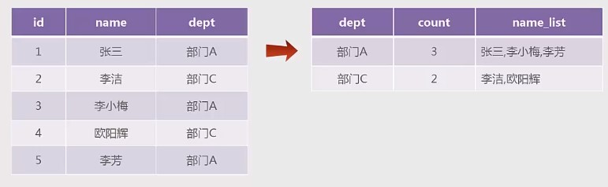

# GROUP_CONCAT 函数

### 应用场景

使用 group by 可以分组统计每个部门有多少员工。

假如，除了统计每个部门的员工数量之外，还想知道具体是哪些员工（员工列表），又该如何实现呢？



### 说明

group_concat 配合 group by 一起使用，用于将某一列的值按指定的分隔符进行拼接，MySQL 默认的分隔符为逗号.

### 语法

```
group_concat([distinct] column_name [order by column_name asc/desc][separator '分隔符'])
```

说明：

- distinct : 去重效果；
- order by : 规定字符串拼接顺序；

例子：查询各部门的员工名字

再次注意：用到 group by 时，select 后的第一个字段一定是 被 group by 的字段，然后，后面的字段只能是聚合函数，即 因为 group by dept， 所以 select 第一个 字段就是 dept,后面字段均为聚合函数。


### 例子

- 打印已经存在的 employee 表


- 打印每个部门有多少人

  ```mysql
  select dept, count(*) from employee group by dept;
  ```

  

- 打印每个部门有多少人，并罗列其人名

  ```mysql
  select dept, count(*), group_concat(name) from employee group by dept;
  ```

  

- 打印每个部门有多少人，并按照名字降序，罗列其人名

  ```mysql
  select dept, count(*), group_concat(name order by name desc) from employee group by dept;
  ```

  

- 打印每个部门有多少人，并按照名字降序，罗列其人名, 分隔符为分号

  ```mysql
  select dept, count(*), group_concat(name order by name desc separator ';') from employee group by dept;
  ```

  