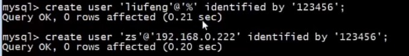
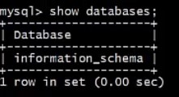
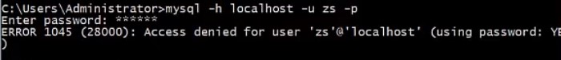

# 用户管理

### 进一步认识 DCL

SQL 语言按功能用途分为4类，分别是 DDL、DML、DQL 和 DCL.

其中，DCL 是数据控制语言，主要用于管理用户和权限.

在企业中，这部分工作通常由 DBA 完成，一般开发人员很少接触.

### * DCL 主要能做什么？

>1. **创建用户**
>2. **删除用户**
>3. **修改密码**
>4. **给用户赋予权限**
>5. **撤销用户权限**

### MySQL 的权限体系

- MySQL 的权限体系大致分为 5 个层级，全局层级、数据库层级、表层级、列层级和子程序层级.

|    层级    | 描述                                                         |
| :--------: | ------------------------------------------------------------ |
|  全局层级  | 适用于一个给定服务器中 **所有的数据库**；<br>这些权限存储在 **mysql.user** 表中；<br> **GRANT ALL ON \*.\* 和 REVOKE ALL ON \*.\* ** 只授予和撤销**全局权限**。 |
| 数据库层级 | 适用于一个给定数据库中的 **所有目标**；<br>这些权限存储在 **mysql.db** 和 **mysql.host** 表中； <br> **GRANT ALL ON db_name.\* 和 REVOKE ALL ON db_name.\***只授予和撤销**数据库权限。** |
|   表层级   | 适用于一个给定表中的 **所有列**；<br>这些权限存储在 **mysql.talbes_priv** 表中；<br>**GRANT ALL ON db_name.tbl_name 和 REVOKE ALL ON db_name.tbl_name** 只授予和撤销**表权限**。 |
|   列层级   | 适用于给一个 给定表中的 **单一列**；<br>这些权限存储在 **mysql.columns_priv** 表中；<br>当使用 **REVOKE** 时，必须指定与被授予列相同的列。 |
| 子程序层级 | **CREATE ROUTINE, ALTER ROUTINE, EXECUTE** 和 **GRANT** 权限适用于已存储的**子程序**；<br>这些权限可以被授予为全局层级和数据库层级；<br>而且，除了 **CREATE ROUTINE 外**，这些权限可以被授予为子程序层级，并存储在 **mysql.procs_priv** 表中。 |

- MySQL 的权限信息主要存储在一下几张表中，当用户连接数据库时，MySQL 会根据这些表对用户进行权限验证:

| 表名       | 描述                                           |
| ---------- | ---------------------------------------------- |
| user       | 用户权限表，记录账号、密码以及全局性权限信息。 |
| db         | 记录数据库相关权限。                           |
| table_priv | 用户对某个表拥有的权限。                       |
| colun_priv | 用户对某表的某个列所拥有的权限。               |
| procs_priv | 用户对存储过程及存储函数的操作权限。           |

### 用户管理

#### 创建用户 (CREATE USER)

使用 **CREATE USER** 来创建用户，用户创建后**没有任何权限**。

```mysql
# create user
CREATE USER ['user_name'][@'host_name'][IDENTIFIED BY 'password']
```

注意：

- MySQL 的用户账号由两部分组成：`用户名` 和 `主机名`，即 `user_name@host_name`;
- 主机名可以是 `IP` 或 `机器名称`；
- 主机名为 `%` 表示允许任何地址的主机远程登陆  MySQL 数据库。

#### 删除用户 (DROP USER)

```mysql
# delete user
DROP USER ['user_name'][@'host_name'];
```

#### 修改密码 （ALTER USER)

```mysql
# alter user
ALTER USER ['user_name'][@'host_name'] IDENTIFIED BY ['new_password']；
```

#### 登陆

```mysql
mysql -h localhost -u user_name - p
```


### 示例

- 打印 user  信息，其中 (\G)  为 格式化输出：

  ```mysql
  select * from user\G;
  ```

  

- 打印建 表语句 信息：

  ```mysql
  show create table user;
  ```

  PRIMARY KEY ('Host','User') : 显示了 定一个用户和一个账号。

- 创建一个用户 ：用户名为 liufeng， 从任何地方都能连进来，且密码为 123456

  ```mysql
  create user 'liufeng'@'%'identified by '123456';
  ```

- 创建一个用户 ：用户名为 zs， 主机名为 192.168.0.222, 且密码为 123456

  ```mysql
  create user 'zs'@'192.168.0.222'identified by '123456';
  ```

  
  
- 登陆 liufeng ，输入密码 ，因为是 主机名定义的时候 是 %，所以本机地址也可以登陆

  

  因为没有赋予权限，所以看不到 MySQL 的表, 仅仅只能用于登陆，不能进行操作

  

  

- 登陆 zs,输入密码，因为主机地址 是 192.168.0.222，所以本机不能访问，只能 主机地址是 192.168.0.222 的访问

  