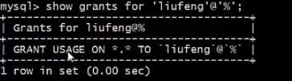
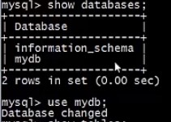
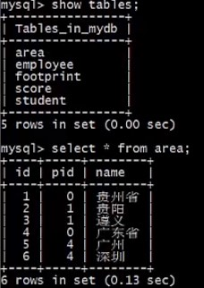
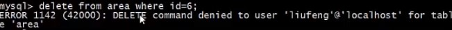
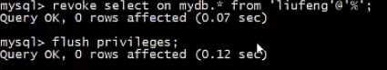
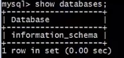

# 权限管理

### 介绍

在 MySQL 数据库中，使用 **grant** 命令授权、**revoke** 命令撤销授权。

### Code

- 授权

  ```mysql
  # 授权
  grant all privileges on databaseName.tableName to 'user_name'[@'host_name'];
  ```

  

- 撤销授权

  ```mysql
  # 撤销授权
  revoke all privileges on databaseName.tableName from 'user_name'[@'host_name'];
  ```

  

- 刷新权限

  ```mysql
  # 刷新权限
  FLUSH PRIVIEGES;
  ```

- 查看权限

  ```mysql
  # 在特定主机下查看权限
  show grants for 'user_name'[@'host_name'];
  
  # 在任何主机下查看权限
  show grants for 'user_name'[@'%'];
  ```

  

### MySQL 权限列表

使用 **grant** 和 **revoke** 进行授权、撤销授权时，需要指定具体是哪些权限，这些权限大体可以分为 3 类，**数据类、结构类和管理类**。

| 数据                                         | 结构                                                         | 管理                                                         |
| -------------------------------------------- | ------------------------------------------------------------ | ------------------------------------------------------------ |
| SELECT<br>INSERT<br>UPDATE<br>DELETE<br>FILE | CREATE<br>ALTER<br>INDEX<br>DROP<br>CREATE TEMPORARY TABLES<br>SHOW VIEW<br>CREATE ROUTINE<br>ALTER ROUNTINE<br>EXECUTE<br>CREATE VIEW<br>EVENT<br>TRIGGER | USAGE<br>GRANT<br>SUPER<br>PROCESS<br>RELOAD<br>SHUTDOWN<br>SHOW DATABASES<br>LOCK TABLES<br>REFERENCES<br>REPUCATION CUENT<br>REPUCATION SLAVE<br>CREATE USER |


### 例子

- 查看 liufeng 用户的 权限信息

  ```mysql
  show grants for 'liufeng'@'%';
  ```

  

- 给 liufeng 用户 赋予对 mydb 数据库的 select 权限 

  ```mysql
  grant select on mydb.* to 'liufeng'@'%';
  ```

  

  因为，liufeng 用户 已经有 mydb 数据库 的 所有权限了，所以可以对 mydb 表 进行操作

  ```mysql
  # 显示 所有 数据库
  show databases;
  
  # 使用 mydb 表
  use mydb;
  ```

  

  ```mysql
  # 显示 所有 的 表
  show tables;
  
  # 打印 area 表
  select * from area;
  ```

  



- 因为没有给 liufeng 用户 赋予 对 mydb 数据库的 delete 权限，所以无法使用：

  ```mysql
  delete from area where id = 6;
  ```

  

- 撤销 赋予给 liufeng 用户 对 mydb 数据库 select 的权限

  ```mysql
  # 撤销权限
  revoke select on mydb.* from 'liufeng'@'%';
  
  # 刷新权限
  flush privileges;
  ```

  

  展示所有数据库,因为 liufeng 用户 对 mydb 数据库 的操作权限以及移除，所以，mydb 数据库 不再显示：

  ```mysql
  show databases;
  ```

  