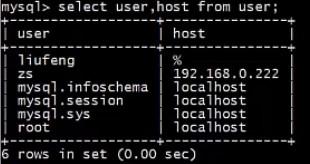
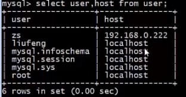

# 禁止 ROOT 用户远程登陆

### 为什么要禁止 root 远程登陆?

在实际工作中，公司的 DBA 都会设置禁止 root 用户远程登陆，请问这是为什么？

>1. **root 是 MySQL 数据库的超级管理员，几乎拥有所有权限，一旦泄露后果非常严重；**
>2. **root 是 MySQL 数据库的默认用户，所有人都知道，如果不禁止远程登陆，可以针对 root 用户暴力破解密码。**


### 操作

- 进入 mydb 数据库

  ```mysql
  use mysql;
  ```

- 查看 mydb 数据库中 user 表的 user 和 host 信息

  ```mysql
  select user,host from user;
  ```

  

- 更新 liufeng 用户的 host 信息，改成 localhost

  ```mysql
  # 更新
  update user set host='localhost' where user='liufeng';
  
  # 打印
  select user,host from user;
  ```

  

  