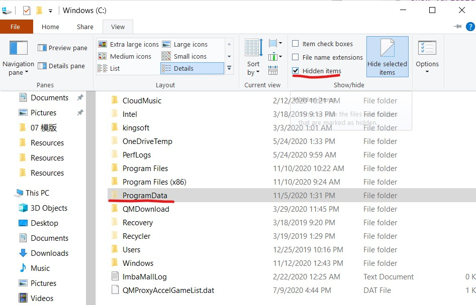
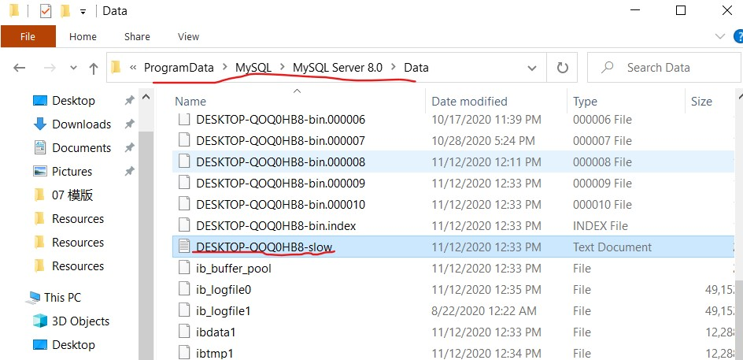
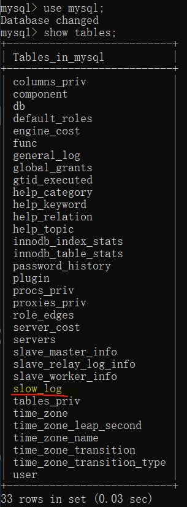
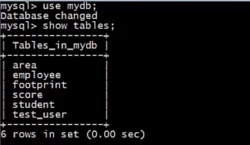
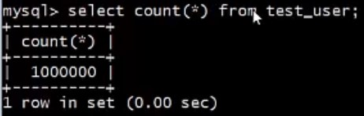
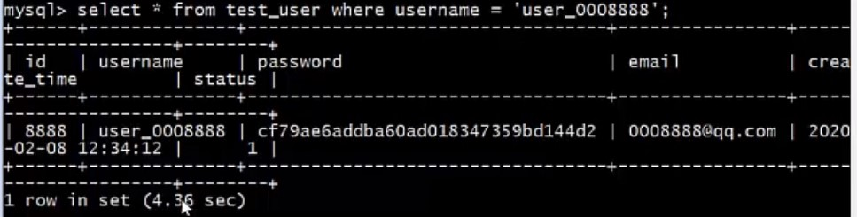
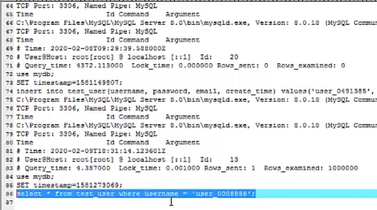
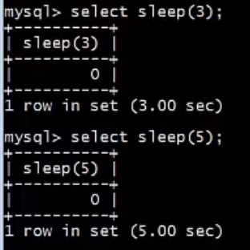
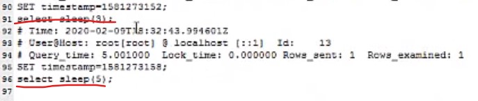

#  慢查询日志

## Outline

1. 了解MySQL的日志类型
2. 掌握如何开启慢查询日志

## MySQL 的日志类型

日志用于记录数据库的运行情况，以及用户对数据库执行的各类操作。

当数据库发生故障时，可以根据日志分析和解决问题，从而对数据库进行恢复。

| 日志                        | 描述                                                         |
| :-------------------------- | :----------------------------------------------------------- |
| 重做日志 (redo log)         | 重做日志是一种物理格式的日志，记录的是物理数据页面的修改信息，其 redo log 是顺序写入 redo log file 的物理文件中去。 |
| 回滚日志(undo log)          | 回滚日志是一种逻辑格式的日志，在执行 undo 的时候，仅仅是将数据从逻辑上恢复至事务之前的状态，而不是从物理页面上操作实现的，这一点是不同于 redo log 的。 |
| 二进制日志（bin log)        | 二进制日志是一种逻辑格式的日志，以二进制文件的形式记录了数据中的操作，但不记录查询语句。 |
| 错误日志（error log)        | 错误日志记录着 mysql 启动和停止，以及服务器正在运行过程中发生的错误的相关信息。 |
| 慢查询日志（slow query log) | 慢查询日志记录执行时间过长和没有使用索引的查询语句。         |
| 一般查询日志（general log)  | 记录了服务器接收到每一个查询或是命令，无论这些查询或是命令是否正确甚至是否包含语法错误，general log 都会将其记录下来。 |
| 中继日志(relay log)         | 类似二进制，可用于复制架构中，使从服务器和主服务器的数据保持一致。 |

## 慢查询日志

### 认识慢查询日志

慢查询日志用于记录 MySQL 数据库中响应时间超过指定阙值得语句。

慢查询日志通常也被称之为慢日志，因为它不仅仅只针对 SELECT 语句，像 INSERT、UPDATE、DELETE等语句，只要响应时间超过所设定阙值都会记录在慢查询日志中。

| 参数                        | 描述                                                         |
| --------------------------- | ------------------------------------------------------------ |
| **slow_query_log**          | 是否开启慢查询日志，1 or ON 表示开启，0 or OFF 表示关闭。<br>此变量是全局变量，所以需要使用 global 全局变量。<br>set global slow_query_log = ON or 1;    开启慢查询<br>set global slow_query_log = OFF or 0;   关闭慢查询。 |
| slow_query_log_file         | 慢查询日志存储路径，可选。<br> 注意：MySQL 5.6 之前的版本，参数名为 log-slow-queries。 |
| long_query_time             | 阙值，当 SQL 语句的响应时间超过该阙值就会被记录到日志中。    |
| log_query_not_using_indexes | 未使用索引的查询也被记录到慢查询日志中，可选。               |
| log_output                  | 日志存储方式，默认为 FILE。<br>log_output = 'FILE'              表示将日志存入文件。<br>log_output = 'TABLE'          表示将日志存入数据库中。<br>log_output = 'FILE,TABLE'  表示同时将日志存入文件和数据库中。 |

### 如何开启慢查询日志

慢查询日志可以通过命令临时设置，也可以修改配置文件永久设置。

- 查看是否开启慢查询日志

  ```mysql
  show variables like 'slow%';
  ```

- 临时开启慢查询日志

  ```mysql
  set slow_query_log = 'ON';
  set long_query_time = 1;
  ```

- 慢查询日志文件所在位置

  ```mysql
  show variables like '%datadir';
  ```

  

## 演示

- 查看数据库参数设置

  ```mysql
  show variables like '%slow%';
  ```

  

  

- 打开慢查询

  ```mysql
  set global slow_query_log = ON;
  ```

  

- 查看阙值,下面列子的阙值为 10s

  ```mysql
  show variables like '%long%';
  ```

  

- 把阙值改成 1s, 并再次查看阙值

  ```mysql
  set long_query_time = 1;
  show variables like '%long%';
  ```

  

  

- 查看日志输出位置,下面例子输出到文件

  ```mysql
  show variables like '%log_output%';
  ```

  

- 查看输出的日志文件,此文件是个隐藏文件，需要设值

  ```mysql
  show variables like '%datadir%';
  ```

  

  设置显示隐藏文件

  

  查找 slow 文件

  

- 如果慢日志没有存在文件中，而是存在表中的，则在 mysql 数据库中的 slow_log 表中查询

  例子为 查询 mysql 库中的 slow_log 表 

  ```mysql
  use mysql;   # 使用 mysql 库
  show tables; # 展示 mysql 库 中的所有表
  ```

  

- 更换成 mydb 库, 并显示其表

  ```mysql
  use mydb;
  show tables;
  ```

  

  

- （1）计算 test_user 表中 数据的个数，查询时间为 0 s 小于设置的阙值 1s, 所以不会进入慢日志

  ```mysql
  select count(*) from test_user;
  ```

  

  （2）查找一个测试数据，查询时间为 4s 大于设置的阙值 1s，所以会进入慢日志

  ```mysql
  select * from test_user where username = 'user_0008888';
  ```



打开慢日志，（1）没有进入慢日志，（2）进入了慢日志



- 用 sleep(); 函数 测试 

  ```mysql
  # 休眠 3 s
  select sleep(3);
  
  # 休眠 5 s
  select sleep(5);
  ```

  

  重新打开慢日志, sleep(3), sleep(5) 都被记录下来了。

  