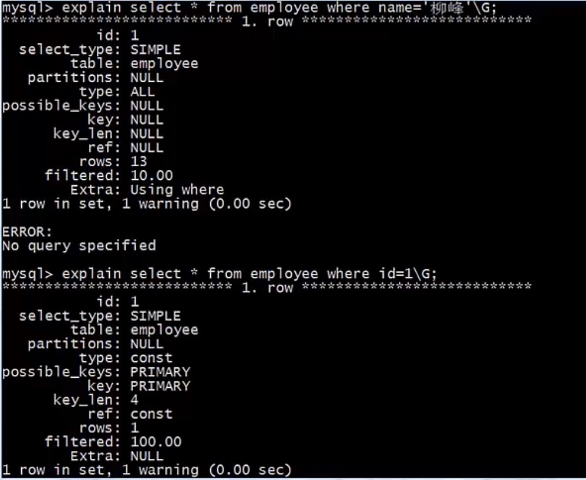
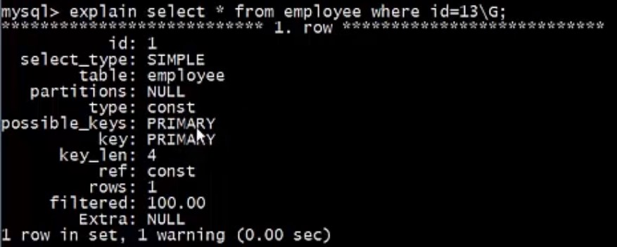

# 查询分析器 EXPLAIN

## Target

1. 了解什么是 **explain** ？ 能做什么？
1. 掌握 **explain** 的使用

## EXPLAIN

### 简介

explain 命令可以查看 SQL 语句的执行计划。当 explain 与 SQL 语句一起使用时，MySQL 将显示来自优化器的有关语句执行计划的信息，也就是说，MySQL 解释了它将如何处理语句，包括有关如何连接以及以何种顺序连接表的信息。

### 能做什么

>**1.分析出表的读取顺序**
>
>**2. 数据读取操作的操作类型**
>
>**3. 哪些所以可以使用**
>
>**4. 哪些索引被实际使用**
>
>**5. 表之间的引用**
>
>**6. 每张表有多少行被优化器查询**

### 使用

explain 的使用很简单，只需要在 SQL 语句之前加上 **explain** 命令, 结尾加上 **\G** 即可使输出格式化，方便阅读.

能分析的语句：select、insert、update、delete.



### 结果解析

| 参数          | 描述                                                         |
| ------------- | ------------------------------------------------------------ |
| id            | 执行 select 子句或操作表的顺序。                             |
| select_type   | 查询的类型，如 SIMPLE、PRIMARY、SUBQUERY、DERIVED、UNION等。 |
| table         | 当前行使用的表名。                                           |
| partitions    | 匹配分区。                                                   |
| **type**      | **连接类型，如 system、const、eq_ref、range、index、all等。<br>查询效果 ： 类型越向 system 方向的查询效率越高，越向 all 方向的查询效率越低。** |
| possible_keys | 可能使用的索引。                                             |
| **key**       | **实际使用的索引，NULL表示未使用索引。**                     |
| key_len       | 查询中使用的索引长度。                                       |
| ref           | 列与索引的比较。                                             |
| **rows**      | **扫描的行数。 <br>行数越少，查询效率越高。**                |
| **filtered**  | **选取的行数占扫描的行数的百分比，理想的结果是 100.**        |
| extra         | 其他额外信息。                                               |

## 例子

- 查看 employee 表

  

- 查看 对 名字为柳峰的雇员的查询语句 的信息

  ```mysql
  explain select * from employee where name = '柳峰'\G;
  ```

  

  

- 查看 对 id = 13 的雇员的查询语句 的信息

  ```mysql
  explain select * from employee where id = 13\G;
  ```

  

- 查看 对 test_user 表中 用户名为 user_0008888的查询语句 的信息

  ```mysql
  explain select * from test_user where username = 'user_0008888'\G;
  ```

