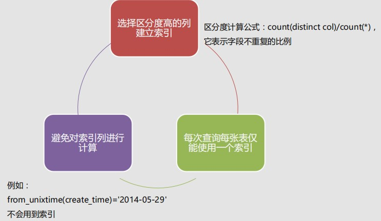

# 索引的基本使用

## Target

1. 了解索引及其作用

2. 熟悉常见的索引种类

3. **★掌握索引的基本使用**

4. 掌握索引的实战经验

## 索引

### 什么是索引

**索引是一种特殊的数据结构，类似于图书的目录，它能够极大地提升数据库的查询效率。**

如果没有索引，在查询数据时必须扫描表中的所有记录才能找出符合条件的记录，这种**全表扫描的查询效率非常低**。


### 常见的索引种类

**索引是对数据库表中一列或多列的值进行排序的一种结构，使用索引可快速访问数据库表中的特定记录。**

- **数据库的索引好比一本书的目录，能够加快数据库的查询速度；**

- **索引是快速搜索的关键，如果不加索引，查找任何一条特定的数据都会进行一次全表扫描**。

| 索引种类 | 描述                                                         |
| -------- | :----------------------------------------------------------- |
| 普通索引 | 最基本的索引，没有任何限制，仅加速查询。                     |
| 唯一索引 | 索引列的值必须唯一，但允许有空值。                           |
| 主键索引 | 一种特殊的唯一索引，不允许有空值。一般是在建表的同时自动创建主键索引。 |
| 复合索引 | 两个或多个列上的索引被称作复合索引。                         |
| 全文索引 | 对文本内容进行分词索引。                                     |

### 索引的使用

- 创建索引

  ```mysql
  # 创建普通索引
  CREATE INDEX index_name ON table_name(column_name(length));
  
  # 创建唯一索引
  CREATE UNIQUE INDEX index_name ON table_name(column_name(length));
  
  # 创建复合索引
  CREATE INDEX index_name ON table_name(column_name1,column_name2,...);
  ```

  

- 删除索引

  ```mysql
  DROP INDEX [index_name] ON table_name;
  ```

- 查看索引

  ```mysql
  SHOW INDEX FROM table_name;
  ```

### 索引的实战经验

- **选择区分度高的列建立索引**

  区分度计算公式：$count\ (distinct col) \ / \ count(*)$，表示字段不重复的比例.

- **每次查询每张表仅能使用一个索引**.

- **避免对索引列进行计算**.

  例如：from_unixtime(create_time) = '2014-05-29' 	不会用到索引

## 例子


