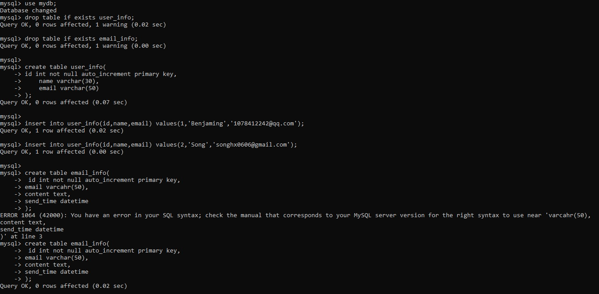
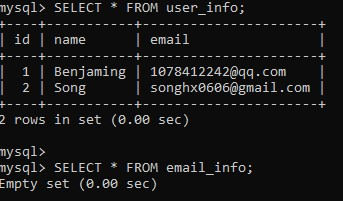
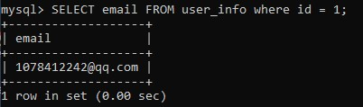
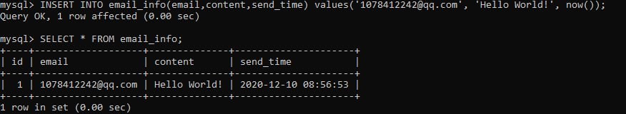
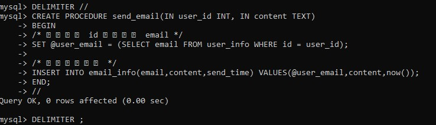
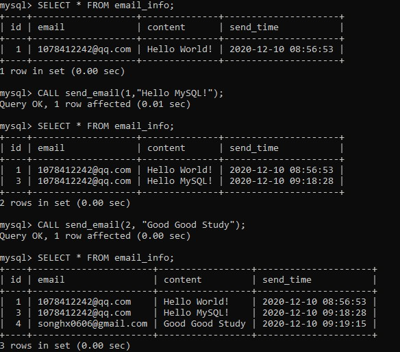

# 存储过程实战：给指定用户发邮件通知

## 测试数据及需求描述

- 根据传入的用户 id 和 内容发送邮件

```mysql
drop table if exists user_info;
drop table if exists email_info;

create table user_info(
	id int not null auto_increment primary key,
    name varchar(30),
    email varchar(50)
);

insert into user_info(id,name,email) values(1,'Benjaming','1078412242@qq.com');
insert into user_info(id,name,email) values(2,'Song','songhx0606@gmail.com');

create table email_info(
 	id int not null auto_increment primary key,
	email varchar(50),
	content text,
	send_time datetime
);
```



- 查看 存在的表， 并且 查看 里面的数据

```mysql
show tables;

SELECT * FROM user_info;

SELECT * FROM email_info;
```



- 在 email_info 表中 查找 id = 1 的邮箱

  ```mysql
  SELECT email FROM user_info WHERE id = 1;
  ```

  

- 向  email_info 表中插入数据

  ```mysql
  INSERT INTO email_info(email,content,send_time) VALUES('1078412242@qq.com', 'Hello World!', now());
  ```

  

## 存储过程示例：根据用户 id 和 邮件内容 content 给用户发邮件


```mysql
DELIMITER //
CREATE PROCEDURE send_email(IN user_id INT, IN content TEXT)
BEGIN
	/* 根据用户 id 查询邮箱 email */
	SET @user_email = (SELECT email FROM user_info WHERE id = user_id);
	
	/* 模拟发送邮件 */
	INSERT INTO email_info(email,content,send_time) VALUES(@user_email,content,now());
END;
//
DELIMITER ;			/* DELIMITER 与 ; 之间有一个空格*/
```



```mysql
/* 查看 email_info 表的信息*/
SELECT * FROM email_info;

/* 调用 send_email 存储过程 */
CALL send_email(1, "Hello MySQL!");

/* 查看 email_info 表的信息*/
SELECT * FROM email_info;

/* 调用 send_email 存储过程 */
CALL send_email(2, "Good Good Study");

/* 查看 email_info 表的信息*/
SELECT * FROM email_info;
```




- 如果显示 已经存在 某 存储过程 procedure_name

  ```mysql
  ERROR 1304 (42000) : PROCEDURE procedure_name already exists
  ```

  则用 下面语句把 之前存在的存储过程 procedure_name 取消

  ```mysql
  DROP PROCEDURE procedure_name;
  ```