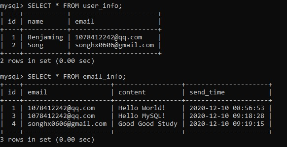
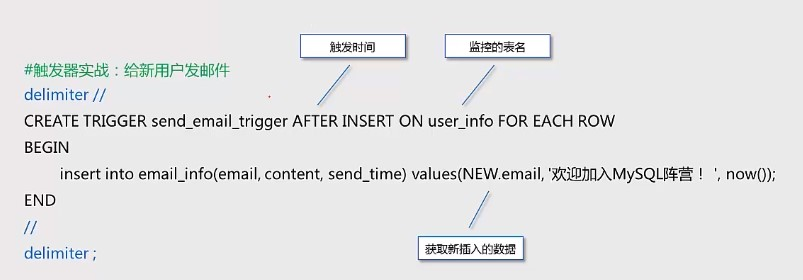
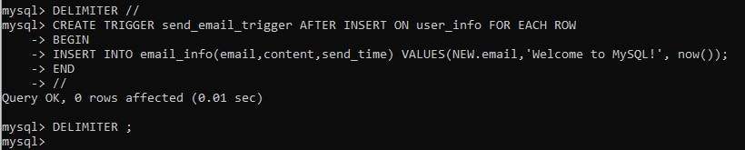
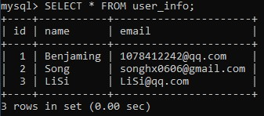
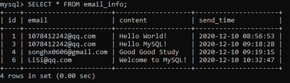
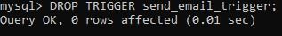

# 触发器

## 什么是触发器

触发器 (Trigger) 用于监视某种情况并触发某种操作，它是与表事件相关的特殊的存储过程，**它的执行不是由程序调用，而是由事件来触发**。

例如，当对某张表 insert、delete、update 操作时就会触发执行它.

## 创建触发器语法

```mysql
CREATE TRIGGER trigger_name trigger_time trigger_event ON table_name FOR EACH ROW trigger_stmt
```

- *参数说明：*
  - *trigger_name : 触发器名称;*
  - *trigger_time : 触发时间，取值有 before、after；*
  - *trigger_event : 触发事件,取值有 insert、update、delete;*
  - *table_name : 触发器监控的表名;*
  - *trigger_stmt ：触发执行的语句，可以使用 OLD、NEW 来引用变化前后的记录内容*
    - *NEW.columnName : 获取 INSERT 触发事件中新插入的数据*
    - *OLD.columnName : 获取 UPDATE 和 DELETE 触发事件中被更新、删除的数据*

## 删除触发器

```mysql
DROP TRIGGER trigger_name;
```


## 测试数据及需求描述

- 需求描述 : 当有新用户插入时，自动给用户发送邮件

- 建表

  ```mysql
  DROP TABLE IF EXISTS user_info;
  DROP TABLE IF EXISTS email_info;
  
  CREATE TABLE user_info(
  	id INT NOT NULL AUTO_INCREMENT PRIMARY KEY,
  	name VARCHAR(30),
  	email VARCHAR(50)
  );
  
  INSERT INTO user_info(id,name,email) VALUES(1,'Benjaming','1078412242@qq.com');
  INSERT INTO user_info(id,name,email) VALUES(2,'Song','songhx0606@gmail.com');
  
  CREATE TABLE email_info(
  	id INT NOT NULL AUTO_INCREMENT PRIMARY KEY,
  	email VARCHAR(50),
  	content TEXT,
  	send_time DATETIME
  );
  ```

  ## 触发器实战：给新用户发邮件

- 查看 email_info 表 和 user_info 表

  ```mysql
  SELECT * FROM user_info;
  
  SELECT * FROM email_info;
  ```

  

- 创建触发器

  ```mysql
  DELIMITER //
  CREATE TRIGGER send_email_trigger AFTER INSERT ON user_info FOR EACH ROW
  BEGIN
  	INSERT INTO email_info(email,content,send_time) VALUES(NEW.email,'Welcome to MySQL!', now());
  END
  //
  DELIMITER ;
  ```

  

  

  

  

- 向 user_info 表中插入数据

  ```mysql
  INSERT INTO user_info(id,name,email) VALUES(3,'LiSi','LiSi@qq.com');
  ```

  

- 查看 user_info 表 和 email_info 表

  ```mysql
  SELECT * FROM user_ifo;
  
  SELECT * FROM email_info;
  ```

  



​		说明：

​		因为 send_email_trigger 这个触发器监控的是 user_info 表，所以当向 user_info 表插入消息时，触发器被触发，

​		执行 触发器中的命令 向 email_info 表中插入数据.

- 删除触发器 

  ```mysql
  DROP TRIGGER send_email_trigger;
  ```

  