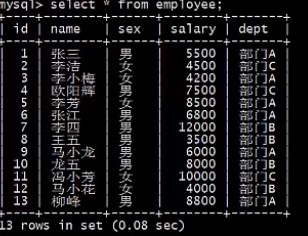
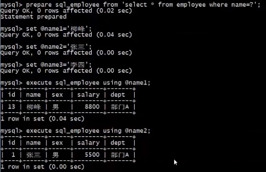
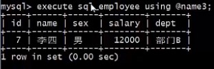
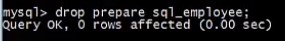

# 预处理 （绑定变量）

## 什么是预处理

从 MySQL 4.1 开始，就支持预处理语句（Prepared Statement), 这大大提高了客户端和服务器端数据传输的效率。

当创建一个预定义 SQL 时，客户端向服务器发送一个 SQL 语句的原型；服务器端接收到这个 SQL 语句后，解析并存储这个 SQL 语句的部分执行计划，返回给客户端一个 SQL 语句处理句柄，以后每次执行这条 SQL，客户端都指定使用这个句柄。

- 即时 SQL （一次编译、一次运行）,一般 SQL

  > 1. 语法和词义的解析；
  > 2. 优化 SQL 语句，指定执行计划；
  > 3. 执行SQL 语句并返回结构。
  >
  > 1. 语法和词义的解析；
  > 2. 优化 SQL 语句，制定执行计划；
  > 3. 执行 SQL 语句并返回结果;
  >
  > ... ... ...

- **预处理 SQL （一次编译、多次运行）**

  >1. **<font color="red"> 语法和词义的解析；</font>**
  >2. **<font color="red">优化SQL语句，制定执行计划；</font>**
  >3. 执行SQL语句并返回结果；
  >
  >3. 执行SQL语句并返回结果;
  >
  >... ... ...

## 预处理的优势

### 高效执行重复 SQL

- 在服务器端只需要解析一次 SQL
- 在服务器端某些优化器的工作只需要执行一次，它会缓存一部分执行计划

### 减少网络开销

- 对于重复执行的 SQL，后续只需要将参数发送到服务器端，而不是整个 SQL 语句，因此网络开销会更小。

### 更加安全

- 使用预处理语句，无须在应用程序中处理转义，也大大减少了 SQL 注入和攻击的风险。

  ## 预处理的基本使用

- MySQL 支持 SQL 接口的预处理，即不使用二进制传输协议也可以直接以 SQL 的方式使用预处理。

### 定义预处理语句

```mysql
PREPARE stmt_name FROM preparable_stmt;
```

### 设置参数，并执行预处理语句

```mysql
SET @var_name1 = 'value1';
SET @var_name2 = 'value2';
...

EXECUTE stmt_name [USING @var_name1 [,@var_name2] ...];
```

### 删除（释放）定义

```mysql
{DEALLOCATE | DROP} PREPARE stmt_name;
```


## 例子

- 查看 employee 表

  ```mysql
  SELECT * FROM employee;
  ```

  

- 创建预处理, 并设置参数执行

  ```mysql
  PREPARE sql_employee FROM 'SELECT * FROM employee WHERE name = ?';
  
  SET @name1 = '刘峰';
  
  SET @name2 = '张三'；
  
  SET @name3 = '李四'；
  
  EXECUTE sql_employee USING @name1;
  
  EXECUTE sql_employee USING @name2;
  
  EXECUTE sql_employee USING @name3;
  ```

  
  
  

- 释放（删除）预处理

  ```mysql
  DROP PREPARE sql_employee;
  ```

  ​	