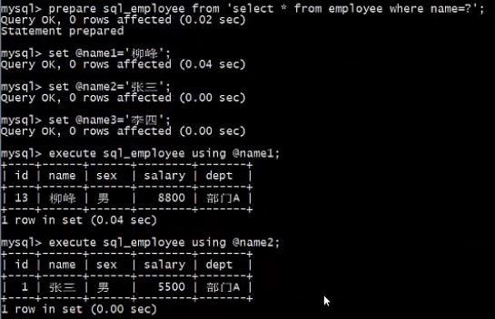
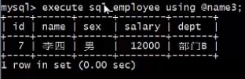

# 复制表的几种方式

## 复制表的几种方式

### 只复制表结构

```mysql
CREATE TABLE tableName Like someTable;
```

只复制表结构，包括主键、索引，但不会复制表数据。

### 只关注表数据

```mysql
CREATE TABLE tableName SELECT * FROM someTable;
```

复制表的大体结构以及全部数据，不会复制主键、索引等。

### 完整复制 ： 表结构 + 数据

```mysql
CREATE table tableName LIKE someTable;
INSERT INTO tableName SELECT * FROM someTable;
```

分两步完成，先复制表结构，再插入数据。

## 例子

- 创建表 以及 索引

  ```mysql
  CREATE TABLE t1(
  	id INT NOT NULL AUTO_INCREMENT PRIMARY KEY,
  	name VARCHAR(50) COMMENT 'XingMing'
  );
  
  INSERT INTO t1(name) VALUES('ZhangSan');
  INSERT INTO t1(name) VALUES('LiSi');
  
  CREATE INDEX idx_name ON t1(name);
  ```

  

- 查看所创建表数据和索引信息

  ```mysql
  SELECT * FROM t1;
  
  SHOW INDEX FROM t1;
  ```

  

- 只复制表结构：创建新表 t2, 且 只复制 t1 表结构, 并查询 t2 表信息，结果可以发现，t2 只是把 t1 的结构复制了，数据并没有复制

  ```mysql
  CREATE TABLE t2 like t1;
  
  SELECT * FROM t2;
  
  SHOW INDEX FROM t2;
  
  SHOW CREATE TABLE t2;
  
  ```

  

  

- 只关注表数据：创建新表 t3, 只复制数据，并查询 t3 表信息, 结果可以发现 t3 将表的数据复制了，但结构并没有完全复制，t3 只是 大体复制了  t1 的结构

  ```mysql
  CREATE TABLE t3 SELECT * FROM t1;
  
  SELECT * FROM t3;
  
  SHOW INDEX FROM t3;
  
  SHOW CREATE TABLE t3;
  ```

  

- 完全复制：创建新表 t4, 复制 t1 的结构和数据, 结果可以发现 t4 复制了 t1 的表结构和数据.

  ```mysql
  CREATE TABLE t4 LIKE t1;
  
  INSERT INTO t4 SELECT * FROM t1;
  
  SELECT * FROM t4;
  
  SHOW INDEX FROM t4;
  
  SHOW CREATE TABLE t4;
  ```

  